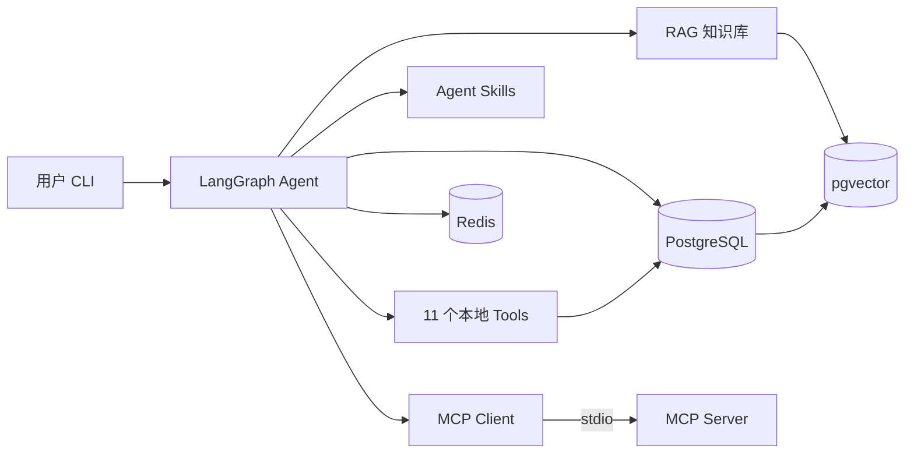
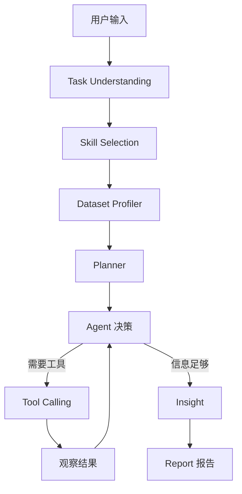
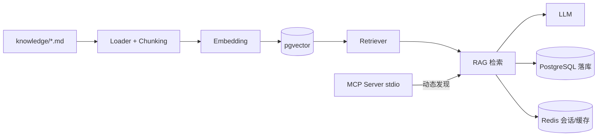

# AI Data Analyst Agent

[](https://github.com/non-precipitating-cloud/ai-data-analyst-agent/actions/workflows/ci.yml)

一个基于 **LangGraph** 的本地 AI 数据分析智能体：用户提供 CSV / Excel / JSON 数据文件 + 一句自然语言需求，
Agent 自主规划、自主调用工具执行真实分析、根据中间结果循环决策，最终生成结构化、可追溯的 Markdown 分析报告。

> 当前状态：**Phase 1–13.3 已完成**。完整实现「LangGraph Agent + Tool Calling + Skills + RAG + MCP +
> PostgreSQL + Redis + Docker」，**128 个测试（127 通过 + 1 个依赖 PostgreSQL 的集成用例自动跳过）**，
> 真实 DeepSeek 多轮自主分析跑通并落库；CI（ruff 静态检查 + pytest + Docker 构建校验）已接入 GitHub Actions。

---

## 项目亮点

- 🤖 **LangGraph 自主 Agent**：任务理解 → Skill 选择 → 数据画像 → 规划 → Tool Calling 循环 → 洞察 → 报告，LLM 根据中间结果动态决定下一步，非固定流程。
- 🔧 **Tool Calling**：11 个分析工具（文件读取 / Python 沙箱 / SQL 只读 / 统计 / 相关性 / 异常检测 / 图表 / RAG / 报告），工具失败自动回传 LLM 换方法重试。
- 🧩 **Agent Skills**：7 个可复用分析方法（销售 / 财务 / 异常 / 相关 / 清洗等），LLM 语义选择 + 关键词回退，按需注入上下文。
- 🔍 **RAG**：PostgreSQL + pgvector 向量知识库，检索数据分析方法论辅助决策，不可用时自动回退内存实现。
- 🔌 **MCP（Model Context Protocol）**：stdio 标准化暴露 7 个分析能力，与本地工具动态共存（`mcp__` 前缀区分）。
- 🗄️ **PostgreSQL + Redis**：业务数据落库（6 表）+ 会话/缓存，全程优雅降级（不可用仅告警不中断）。
- 🐳 **Docker 容器化**：`docker compose up -d` 一键启动 agent + postgres + redis，镜像内置思源黑体。
- 🛡️ **安全执行**：Python AST 沙箱 + SQL 只读四层守卫 + Agent 防死循环。
- 🈶 **中文图表开箱可用**：按平台自动探测已安装中文字体（Noto CJK / 文泉驿 / 雅黑 / 苹方等），不再出现方框。
- ✅ **128 个测试（127 通过 + 1 跳过）**，真实 Demo 端到端跑通，CI 全绿。

---

## 核心能力

- **LangGraph Agent**：任务理解 → Skill 选择 → 数据画像 → 规划 → Tool Calling 循环 → 洞察 → 报告，LLM 自主决策。
- **11 个分析工具**：文件读取 / Python 沙箱 / SQL 只读 / 统计 / 相关性 / 异常检测 / 图表 / RAG / 报告。
- **Agent Skills**：7 个可复用分析方法（销售 / 财务 / 异常 / 相关 / 数据清洗等）。
- **RAG**：pgvector 向量知识库检索方法论。
- **MCP**：标准化（stdio）暴露数据分析能力，与普通工具共存。
- **持久化**：PostgreSQL 落库 + Redis 会话/缓存，全程优雅降级。
- **安全**：Python 沙箱、SQL 只读守卫、Agent 防死循环。

## 技术栈

Python 3.11+ · LangChain · LangGraph · Pandas · NumPy · Matplotlib · SQLAlchemy ·
PostgreSQL + pgvector · Redis · MCP · Docker

## 系统架构

### 总体架构



### LangGraph Agent 工作流



### RAG / PostgreSQL / Redis / MCP 关系



## 环境要求

- Python 3.11+
- Docker（用于启动 PostgreSQL + pgvector + Redis）
- OpenAI 兼容 LLM API Key（DeepSeek / Qwen / Kimi / GLM / OpenAI 等）

---

## 快速开始（从零启动）

```bash
# 1. 克隆项目
git clone <your-repo-url> ai-data-analyst-agent
cd ai-data-analyst-agent

# 2. 配置环境变量
cp .env.example .env
# 编辑 .env，填入 LLM_API_KEY（必要时改 LLM_BASE_URL / LLM_MODEL）

# 3. 启动基础设施（PostgreSQL + pgvector + Redis）
docker compose up -d

# 4. 创建虚拟环境并安装依赖
python -m venv .venv
./.venv/Scripts/python.exe -m pip install -e ".[dev]"   # Windows (Git Bash)
# source .venv/bin/activate && pip install -e ".[dev]"   # Linux/macOS

# 5. 初始化数据库表 + 导入知识库（首次运行一次即可）
./.venv/Scripts/python.exe -m src.db.init_db
./.venv/Scripts/python.exe scripts/ingest_knowledge.py

# 6. 运行
./.venv/Scripts/python.exe main.py
```

交互示例：

```
请输入数据文件路径：
> datasets/sales.csv

请输入你的分析需求：
> 分析今年销售额下降的主要原因，找出表现最差的地区和产品，检测异常数据，并生成完整报告。
```

## .env 配置

| 变量 | 必填 | 说明 |
|---|---|---|
| `LLM_API_KEY` | ✅ | LLM API Key（OpenAI 兼容接口） |
| `LLM_BASE_URL` | ✅ | 接口地址，如 `https://api.deepseek.com/v1` |
| `LLM_MODEL` | ✅ | 模型名，如 `deepseek-chat` |
| `LLM_TIMEOUT_SECONDS` | 可选 | LLM 单次 HTTP 调用超时，默认 `60` |
| `LLM_MAX_RETRIES` | 可选 | 429/5xx/网络抖动的自动重试次数（指数退避），默认 `3` |
| `DATABASE_URL` | 可选 | PostgreSQL 连接串（默认已配好） |
| `REDIS_URL` | 可选 | Redis 连接串（默认已配好） |
| `MCP_ENABLED` | 可选 | 是否启用 MCP 工具，默认 `false` |
| `DB_ENABLED` / `REDIS_ENABLED` | 可选 | 持久化开关，默认 `true` |
| `EMBEDDING_*` | 可选 | 填 `EMBEDDING_API_KEY` 用真实语义向量，留空用本地哈希向量 |
| `EXTRA_DATA_DIRS` | 可选 | 额外允许读取数据文件的目录，JSON 数组，如 `["/data"]`；默认仅允许 `datasets/` |
| `MAX_STEPS` 等 | 可选 | Agent 控制参数，保持默认 |

> 变量名 = `settings.py` 中字段名的大写形式（`extra_data_dirs` → `EXTRA_DATA_DIRS`）。
> 写错名字不会报错，只会被静默忽略。

## Docker 启动（全栈）

一键启动完整系统：`agent`（应用）+ `postgres`（pgvector）+ `redis`。

```bash
# 1. 配置环境变量（首次）
cp .env.example .env          # 填入 LLM_API_KEY

# 2. 启动全部服务（agent 自动等待 postgres healthy）
docker compose up -d
docker compose ps             # 确认 postgres healthy / redis + agent running

# 3. 初始化数据库表（首次一次）
docker compose exec agent python -m src.db.init_db

# 4. 运行 Agent（交互式）
docker compose exec agent python main.py
```

> - 容器内通过 Compose 服务名 `postgres` / `redis` 连接（非 localhost），无需改 .env。
> - 报告写入 `reports_data` 数据卷（持久化），可用 `docker cp analyst-agent:/app/reports/xxx.md .` 取回。
> - 宿主机 venv 方式（上方「快速开始」）仍可用，两者互不影响。
> - 数据卷持久化；**不要**执行 `docker compose down -v`（会删除数据）。
> - 中文图表：`python:3.11-slim` 本身不含 CJK 字体，Dockerfile 已额外安装 `fonts-noto-cjk` + `fontconfig`，
>   图表工具会自动探测到 `Noto Sans CJK SC` 并用于标题/轴标签，容器内不再出现方框。

## 示例数据

| 文件 | 说明 |
|---|---|
| `datasets/sales.csv` | 2160 行 × 12 列，月度×地区×产品销售，含 2025 下滑、华东大跌、异常值、销售-利润强相关 |
| `datasets/ecommerce.csv` | 4000 行订单，含退换货 / 评分 / 支付方式 |
| `datasets/financial.csv` | 720 行，部门×科目收入/支出 |

## 真实 Demo 展示

输入 `datasets/sales.csv` + 需求「分析销售额下降的主要原因，找出下降最严重的地区和产品」，Agent 自主完成：

```
[Skill]  已选择 Skills: sales-analysis, anomaly-detection, correlation-analysis
[Agent]  → read_dataset → profile_dataset → execute_python（年度/地区/品类/交叉归因）
         → detect_outliers（IQR 检出 248 个异常值）→ calculate_correlation
         → generate_chart（地区/品类/产品柱状图）→ save_report
```

核心结论（全部来自真实工具结果，非编造）：

- 销售额同比下降 **18.58%**（3.368 亿 → 2.742 亿）
- 下降最严重地区：**华东 -32.7%**，贡献整体降幅 **41.2%**
- 下降最严重品类：**服装 -37.4%**（男士夹克 / 运动鞋 / 女士连衣裙）
- 异常值：IQR 检出 **248 个**（11.48%），多为企业客户大额批量订单
- 生成 3 张图表 + 17 章节 Markdown 报告，并落库到 PostgreSQL（task / agent_run / tool_calls / analysis_results / reports）

> 报告样例：`reports/analysis_report_*.md`；图表：`reports/charts/*.png`

## 运行测试与静态检查

```bash
./.venv/Scripts/python.exe -m pytest                          # 128 项：127 通过 + 1 跳过（需 PostgreSQL）
./.venv/Scripts/python.exe -m pytest --cov=src                # 带覆盖率
./.venv/Scripts/python.exe -m ruff check src scripts main.py tests   # 静态检查
```

以上三项与 CI（`.github/workflows/ci.yml`）执行的命令一致，本地跑绿即大概率 CI 通过。

## 项目结构

```
ai-data-analyst-agent/
├── main.py                  # 入口
├── pyproject.toml
├── Dockerfile               # 应用容器化
├── .dockerignore
├── docker-compose.yml       # agent + PostgreSQL(pgvector) + Redis
├── docker/init.sql
├── .env.example
├── .github/workflows/ci.yml # CI：ruff + pytest + Docker 构建校验
├── scripts/generate_sample_data.py
├── scripts/ingest_knowledge.py   # 知识库导入
├── datasets/                # 示例数据
├── knowledge/               # 知识库 Markdown 文档（7 篇）
├── reports/                 # 报告 + charts/ 图表（运行产物，gitignore）
├── src/
│   ├── config/settings.py   # pydantic-settings 配置
│   ├── logging_config.py
│   ├── llm/factory.py       # OpenAI 兼容 ChatModel 工厂
│   ├── agent/               # LangGraph：state / prompts / graph / nodes / report_builder
│   ├── tools/               # 文件 / Python 沙箱 / SQL 只读 / 统计 / 图表 / RAG / 报告
│   ├── rag/                 # embeddings / 向量存储 / loader / retriever
│   ├── skills/              # Agent Skills：*/SKILL.md + loader/selector
│   ├── mcp/                 # MCP Server（server.py）+ Client/Adapter（client.py）
│   ├── db/                  # SQLAlchemy 模型 / repository / 持久化 service
│   ├── cache/               # Redis 会话 / 缓存
│   └── cli/runner.py        # 交互式 CLI + 进度展示
└── tests/
```

## 已实现的安全限制

- **Python 沙箱**：子进程运行于 workspace、AST 模块白名单、禁用 `eval/exec/compile/open/__import__` 等
  内置函数与危险调用属性、禁用双下划线属性访问（如 `__globals__`/`__subclasses__`，阻断逃逸）、
  超时 + 输出截断。
- **SQL 只读（四层纵深防御）**：
  1. 静态校验：仅允许 `SELECT / WITH / EXPLAIN` 开头，拦截 `DROP/DELETE/UPDATE/INSERT/ALTER` 等，拒绝多语句；
  2. 会话级只读：连接强制 `default_transaction_read_only=on`，绕过关键字过滤也写不进去；
  3. 语句超时：`statement_timeout=10s`，慢查询由数据库主动取消，防拖垮整库；
  4. 行数上限：无 `LIMIT` 的查询自动外包 `LIMIT 1000`，防整表读入内存 OOM。
- **数据文件路径校验**：数据路径统一经 `resolve_dataset_path()` 规范化为绝对路径并做目录边界校验，
  只允许 `datasets/`（及 `EXTRA_DATA_DIRS` 声明的目录）内文件，阻断 `../../.env`、`/etc/passwd`
  一类路径穿越读取。
- **Agent 防死循环**：`max_steps` 上限 + 工具失败不中断 + 错误回传 LLM 自纠。

## RAG（知识库检索）

完整链路：`knowledge/*.md` → 文档加载 → 文本切分 → Embedding → 向量存储 → Retriever → LLM。

- **向量存储**：PostgreSQL + pgvector（真实）；不可用时自动回退到内存实现（离线可跑、可测试）。
- **Embedding**：配置 `EMBEDDING_API_KEY` 用真实语义向量；留空用本地确定性哈希向量。
- **工具**：`retrieve_knowledge` 已加入 Agent 工具集，Agent 自主决定何时检索方法论知识。
- **导入**：`./.venv/Scripts/python.exe scripts/ingest_knowledge.py`（pgvector 时持久化；内存时提示不持久化）。
- **启动基础设施**：`docker compose up -d`（pgvector + Redis）。

## Agent Skills

可复用、可选择、可扩展的专业分析技能，把「怎么分析」从 Prompt 中独立出来。

- **目录**：`src/skills/<slug>/SKILL.md`，含 7 个技能（数据清洗 / 探索性分析 / 销售分析 /
  财务分析 / 异常检测 / 相关性分析 / 报告生成）。
- **Loader**：自动发现并解析 SKILL.md（frontmatter 元数据 + 正文），返回 `SkillMetadata`。
- **Selector**：LLM 语义选择（优先）+ 关键词匹配（回退），只把相关 Skill 注入上下文，不全部塞入。
- **协同**：Skill 提供「分析方法/流程/规则」，RAG 提供「方法论知识」，Tools 负责「实际执行」。
- **流程**：任务理解 → **Skill 选择** → 数据画像 → 规划（遵循 Skill 方法论）→ 工具循环 → 报告。

## MCP（Model Context Protocol）

把数据分析能力以标准化协议（stdio）对外暴露，Agent 通过 MCP Client 动态发现并调用。

- **MCP Server**（`src/mcp/server.py`）：暴露 7 个工具 `read_dataset / get_schema / execute_sql /
  run_analysis / detect_outliers / generate_chart / retrieve_knowledge`，复用现有底层实现（沙箱/只读 SQL 不变）。
- **MCP Client/Adapter**（`src/mcp/client.py`）：持久化 stdio 连接，`list_tools()` 动态发现，
  `build_mcp_tools()` 把 MCP 工具适配为 LangChain 工具（名称加 `mcp__` 前缀，与普通工具区分）。
- **启用**：`.env` 设 `MCP_ENABLED=true`。默认关闭。
- **启动 Server（手动调试）**：`.\.venv\Scripts\python.exe -m src.mcp.server`

两种工具的区分：

| 类型 | 链路 | 示例 |
|---|---|---|
| 普通 LangChain Tool | Agent → 本地函数 → 执行 | `execute_python` |
| MCP Tool | Agent → MCP Client → MCP Server → Tool → Result | `mcp__read_dataset` |

## 持久化（PostgreSQL + Redis）

业务数据落库 + 会话/缓存，全程优雅降级（DB/Redis 不可用时仅告警，不中断 Agent）。

- **PostgreSQL**（`src/db/`）：SQLAlchemy 2.0，6 张表 `datasets / analysis_tasks / agent_runs /
  tool_calls / analysis_results / reports`。初始化：`.\.venv\Scripts\python.exe -m src.db.init_db`。
- **Redis**（`src/cache/`）：会话 `agent:session:{id}`（status/step）+ 通用缓存（JSON + TTL）。
- **接入**：`PersistenceService` 在 Agent 运行中记录 task/run/tool_call（区分 local/mcp）/result/report，
  并实时更新 Redis session 状态；本地 `reports/*.md` 保留不变。
- **开关**：`.env` 设 `DB_ENABLED=true` / `REDIS_ENABLED=true` / `REDIS_CACHE_TTL=3600`。

## 报告系统（结构化、可信、可追溯）

`src/agent/report_builder.py` + `src/agent/nodes/report.py` 将报告升级为 17 章节结构化报告：

- **结构化上下文** `build_report_context()`：统一汇集 dataset_metadata / tool_results / generated_charts /
  insights / observations / skills_context / rag_results，数字全部来自真实工具结果，不凭空生成。
- **图表真实性**：`validate_chart_paths()` 只保留真实存在且扩展名合法的图表；文件名派生友好标题；
  报告只引用实际生成的图表，虚假图表引用被 `sanitize_report()` 自动剔除。
- **质量检查** `validate_report()`：检查非空、章节、占位符、JSON 残留、虚假图表引用（失败仅告警不中断）。


## 后续路线

**已完成**

- ✅ **图表中文字体**：`python:3.11-slim` 基础镜像不含任何 CJK 字体，已在 Dockerfile 安装
  `fonts-noto-cjk` + `fontconfig`；图表工具改为按平台探测系统实际安装的字体（Noto CJK /
  文泉驿 / 微软雅黑 / 苹方等回退链），不再写死字体名。本机（Windows）实测中文标题与轴标签
  生成时 **0 条缺字告警**。
- ✅ **CI/CD**：`.github/workflows/ci.yml` —— ruff 静态检查 + 全量语法编译 + pytest（含覆盖率）
  + Docker 镜像构建校验；main 分支推送时镜像发布到 `ghcr.io`。

**待办**

- README 补充真实运行截图（Agent 执行过程 + 生成的图表）。
