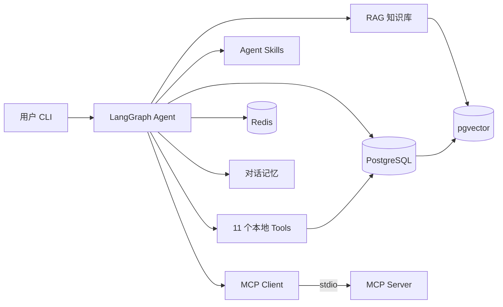
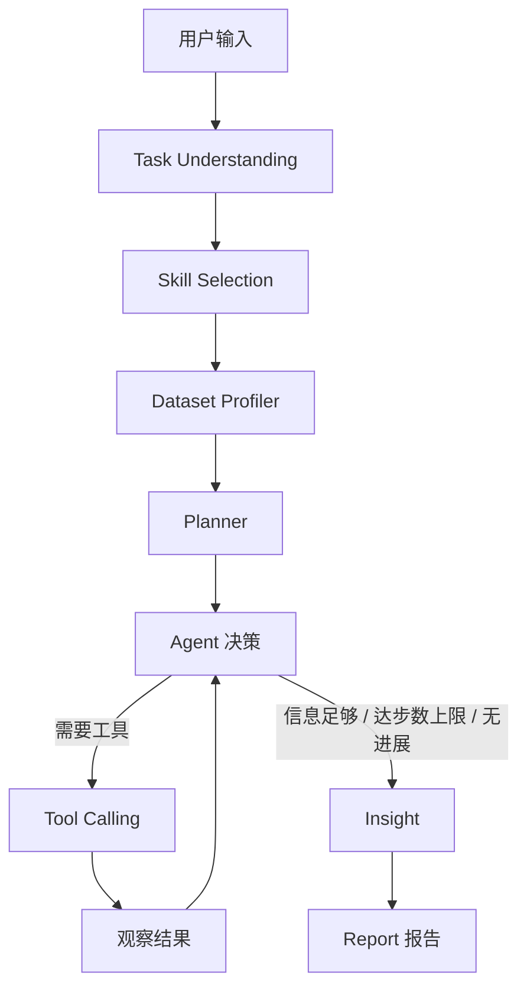

# AI Data Analyst Agent

[](https://github.com/non-precipitating-cloud/ai-data-analyst-agent/actions/workflows/ci.yml)

一个基于 **LangGraph** 的本地 AI 数据分析智能体：用户提供 CSV / Excel / JSON 数据文件 + 一句自然语言需求，
Agent 自主规划、自主调用工具执行真实分析、根据中间结果循环决策并自我纠错，
最终生成结构化、可追溯的 Markdown 分析报告。

> 当前状态：**264 个测试通过 + 1 个跳过**（跳过项需要真实 PostgreSQL），
> **8/8 离线 Agent 评测场景通过**，`ruff` 静态检查通过。
> CI 执行 `ruff` + 全量语法编译 + `pytest` + 离线评测 + Docker 构建校验。

**可信度优先**：本项目所有报告数字都要求来自真实工具执行结果；LLM 无法获得数据时
会明确标注「未完成/降级」，而不是给出看似完整的结论。详见「[可信度保障](#可信度保障)」。

---

## 项目亮点

- 🤖 **LangGraph 自主 Agent**：任务理解 → Skill 选择 → 数据画像 → 规划 → Tool Calling 循环 → 洞察 → 报告，LLM 根据中间结果动态决定下一步，非固定流程。
- 🔧 **11 个分析工具**：文件读取 / schema / 画像 / Python 沙箱 / SQL 只读 / 统计 / 相关性 / 异常检测 / 图表 / RAG / 报告，全部返回**结构化结果**，失败不抛异常、不中断链路。
- 🔁 **Agent 自我纠错**：工具失败返回结构化错误（错误类型 + 可选值 + 修复建议 + 是否可重试），LLM 据此改参数重试；同时设有单工具连续失败上限、单步调用上限、重复调用去重，防止把步数耗在无效重试上。
- 🧩 **Agent Skills**：7 个可复用分析方法（销售 / 财务 / 异常 / 相关 / 清洗等），LLM 语义选择 + 关键词回退，按需注入上下文。
- 🔍 **RAG**：PostgreSQL + pgvector 向量知识库；Embedding 分「真实语义 / 离线词法 / 测试替身」三种实现，**明确区分、不混淆**，检索质量如实上报。
- 🔌 **MCP（Model Context Protocol）**：stdio 标准化暴露 7 个分析能力，与本地工具动态共存（`mcp__` 前缀区分）。
- 🗄️ **PostgreSQL + Redis**：业务数据落库（7 表，含 LLM 调用记录）+ 会话/缓存/对话历史，全程优雅降级（不可用仅告警不中断）。
- 📊 **可观测性**：记录每次 LLM 调用（模型 / token 用量 / 耗时 / 成败）与每次工具调用（入参 / 结果 / 耗时 / 错误），一次运行可完整复盘。
- 💬 **连续对话**：支持「为什么？」这类追问，自动复用同一数据集上一轮的分析结论；换数据集则视为全新任务，历史不污染当前分析。
- 🐳 **Docker 容器化**：`docker compose up -d` 一键启动 agent + postgres + redis（含健康检查与启动顺序），镜像内置思源黑体。
- 🛡️ **安全执行**：Python 沙箱**双层防御**（AST 校验 + 运行时受限 builtins）+ SQL 只读四层守卫；安全边界如实说明，不做过度承诺。
- 🈶 **中文图表开箱可用**：按平台自动探测已安装中文字体（Noto CJK / 文泉驿 / 雅黑 / 苹方等），不再出现方框。

---

## 核心能力

| 能力 | 说明 |
|---|---|
| LangGraph Agent | 任务理解 → Skill 选择 → 数据画像 → 规划 → 工具循环 → 洞察 → 报告 |
| 工具集 | 11 个本地工具 + 7 个 MCP 工具（MCP 默认关闭） |
| 自我纠错 | 结构化错误 → 改参数/换方法 → 重试；带重试上限与去重 |
| 循环控制 | 三条终止路径：LLM 自然收敛 / 步数上限 / 无进展（重复且已成功过） |
| RAG | pgvector 向量库，三种 Embedding 实现，不可用时回退内存 |
| 持久化 | PostgreSQL 落库 + Redis 会话/缓存，全程优雅降级 |
| 连续对话 | 同数据集历史结论注入，跨数据集自动隔离 |
| 可观测性 | LLM 用量与工具耗时全量记录并落库 |
| 安全 | Python 沙箱双层防御、SQL 只读守卫、路径边界校验 |

## 技术栈

Python 3.11+ · LangChain · LangGraph · Pandas · NumPy · Matplotlib · SQLAlchemy ·
PostgreSQL + pgvector · Redis · MCP · Docker

---

## 系统架构



### LangGraph Agent 工作流



---

## 环境要求

- Python 3.11+
- Docker（用于启动 PostgreSQL + pgvector + Redis）
- OpenAI 兼容 LLM API Key（DeepSeek / Qwen / Kimi / GLM / OpenAI 等）

> **不需要** Embedding API Key 也能完整运行：未配置时会回退到离线词法向量
> （见「[RAG 与 Embedding](#rag-与-embedding)」），但请注意其检索质量有限。

---

## 快速开始（从零启动）

```bash
# 1. 克隆项目
git clone https://github.com/non-precipitating-cloud/ai-data-analyst-agent.git
cd ai-data-analyst-agent

# 2. 配置环境变量
cp .env.example .env
# 编辑 .env，填入 LLM_API_KEY（必要时改 LLM_BASE_URL / LLM_MODEL）

# 3. 启动基础设施（PostgreSQL + pgvector + Redis）
docker compose up -d

# 4. 创建虚拟环境并安装依赖
python -m venv .venv
./.venv/Scripts/python.exe -m pip install -e ".[dev]"   # Windows (Git Bash)
# source .venv/bin/activate && pip install -e ".[dev]"   # Linux/macOS

# 5. 初始化数据库表 + 导入知识库（首次运行一次即可）
./.venv/Scripts/python.exe -m src.db.init_db
./.venv/Scripts/python.exe scripts/ingest_knowledge.py

# 6. 运行
./.venv/Scripts/python.exe main.py
```

交互示例：

```
请输入数据文件路径：
> datasets/sales.csv

请输入你的分析需求：
> 分析今年销售额下降的主要原因，找出表现最差的地区和产品，检测异常数据，并生成完整报告。
```

运行结束后可以**直接继续追问**，无需重新加载数据：

```
继续追问（直接输入新问题；/new 更换数据集；/exit 退出）：
> 为什么华东下降最多？
```

## .env 配置

| 变量 | 必填 | 说明 |
|---|---|---|
| `LLM_API_KEY` | ✅ | LLM API Key（OpenAI 兼容接口） |
| `LLM_BASE_URL` | ✅ | 接口地址，如 `https://api.deepseek.com/v1` |
| `LLM_MODEL` | ✅ | 模型名，如 `deepseek-chat` |
| `LLM_TIMEOUT_SECONDS` | 可选 | LLM 单次 HTTP 调用超时，默认 `60` |
| `LLM_MAX_RETRIES` | 可选 | HTTP 429/5xx/网络抖动的自动重试次数（指数退避），默认 `3` |
| `AGENT_LLM_RETRIES` | 可选 | 节点级 LLM 调用失败后的额外重试次数，默认 `2` |
| `MAX_STEPS` | 可选 | Agent 推理步数上限，默认 `15` |
| `PYTHON_TIMEOUT_SECONDS` | 可选 | Python 沙箱执行超时，默认 `30` |
| `TOOL_TIMEOUT_SECONDS` | 可选 | 其他单个工具的执行超时，默认 `60` |
| `TOOL_MAX_CONSECUTIVE_FAILURES` | 可选 | 同一工具连续失败几次后要求模型停止重试，默认 `3` |
| `MAX_TOOL_CALLS_PER_STEP` | 可选 | 单步允许发起的工具调用数上限，默认 `6` |
| `KEEP_RECENT_TOOL_RESULTS` | 可选 | 每轮保留原文的历史工具结果条数，默认 `6` |
| `OUTPUT_TRUNCATE_CHARS` | 可选 | 工具结果落库/回传前的截断长度，默认 `4000` |
| `MAX_DATASET_BYTES` | 可选 | 数据文件体积上限，默认 512 MB |
| `MEMORY_MAX_TURNS` | 可选 | 注入追问上下文的历史轮数上限，默认 `3` |
| `MEMORY_MAX_CHARS` | 可选 | 追问上下文的总字符上限，默认 `4000` |
| `DATABASE_URL` | 可选 | PostgreSQL 连接串（默认已配好） |
| `REDIS_URL` | 可选 | Redis 连接串（默认已配好） |
| `DB_ENABLED` / `REDIS_ENABLED` | 可选 | 持久化开关，默认 `true` |
| `EMBEDDING_PROVIDER` | 可选 | `auto`(默认) / `openai` / `hash`，见 RAG 章节 |
| `EMBEDDING_API_KEY` 等 | 可选 | 配置后使用真实语义向量 |
| `EXTRA_DATA_DIRS` | 可选 | 额外允许读取数据文件的目录，JSON 数组，如 `["/data"]`；默认仅允许 `datasets/` |
| `MCP_ENABLED` | 可选 | 是否启用 MCP 工具，默认 `false` |

> 变量名 = `settings.py` 中字段名的大写形式（`extra_data_dirs` → `EXTRA_DATA_DIRS`）。
> 写错名字不会报错，只会被静默忽略。

## Docker 启动（全栈）

```bash
# 1. 配置环境变量（首次）
cp .env.example .env          # 填入 LLM_API_KEY

# 2. 启动全部服务（agent 等 postgres / redis 健康检查通过后才启动）
docker compose up -d
docker compose ps             # 确认 postgres healthy / redis healthy / agent running

# 3. 初始化数据库表（首次一次）
docker compose exec agent python -m src.db.init_db

# 4. 运行 Agent（交互式）
docker compose exec agent python main.py

# 5.（可选）在容器内跑一次离线评测，验证镜像可用
docker compose exec agent python -m eval.agent_eval
```

> - 容器内通过 Compose 服务名 `postgres` / `redis` 连接（非 localhost），无需改 .env。
> - `redis` 配置了 `redis-cli ping` 健康检查，`agent` 通过 `depends_on.condition` 等待两者就绪，启动顺序确定。
> - 报告写入 `reports_data` 数据卷（持久化），可用 `docker cp analyst-agent:/app/reports/xxx.md .` 取回。
> - **不要**执行 `docker compose down -v`（会删除数据卷）。
> - 宿主机 venv 方式（上方「快速开始」）仍可用，两者互不影响。
> - 中文图表：`python:3.11-slim` 本身不含 CJK 字体，Dockerfile 已额外安装 `fonts-noto-cjk` + `fontconfig`。

## 示例数据

| 文件 | 说明 |
|---|---|
| `datasets/sales.csv` | 2160 行 × 12 列，月度×地区×产品销售，含 2025 下滑、华东大跌、异常值、销售-利润强相关 |
| `datasets/ecommerce.csv` | 4000 行订单，含退换货 / 评分 / 支付方式 |
| `datasets/financial.csv` | 720 行，部门×科目收入/支出 |

---

## 可信度保障

这一节说明「为什么报告里的数字可以信」，以及做不到的部分。

### 数字来源约束

- 报告提示词只提供**工具真实返回的结果**（`build_report_context` 汇总画像、工具结果、图表白名单、洞察），并明确要求「所有数字必须来自给定结果，禁止编造」。
- `validate_report()` 做生成后质检：报告为空、残留模板占位符、缺少 Markdown 标题、引用了白名单之外的图表，都会被记录告警。
- **诚实的边界**：项目**不**逐个校验报告里每个数字是否能在工具结果中找到对应值。LLM 仍有可能写错数字——目前只能靠「只喂真实数据 + 明确禁止编造」来降低概率，无法做到形式化保证。

### 图表真实性

- 图表路径只在 `generate_chart`（含 MCP 版本）**成功执行**后才登记进 `generated_charts` 白名单。
- `validate_chart_paths()` 过滤掉磁盘上不存在的文件，报告只能引用白名单内的图表。
- `sanitize_report()` 会删除引用不存在图表的图片标签，并把合法引用**规范化**为 `charts/<文件名>` —— 否则模型写成绝对路径或裸文件名时链接就是坏的。
- 图表标题通过数据集的**真实列名**还原字段，`unit_price` 这类含下划线的列名也能正确解析。

### 降级可视化

当分析不完整时（LLM 不可用、步数耗尽、工具反复失败），系统不会假装成功：

- 状态里记录 `degraded` 原因，注入报告提示词要求写入「分析局限性」章节；
- LLM 不可用时不再抛异常崩溃，而是走**确定性兜底**：洞察节点如实报告「未生成 AI 洞察」，报告节点用模板把真实工具结果整理成一份可追溯的降级报告；
- CLI 结束时会单独打印降级原因与 LLM 调用统计。

### 循环控制与自我纠错

工具循环的终止条件有三条（见 `graph.route_after_agent`）：

1. LLM 不再请求工具（正常收敛）；
2. 达到 `MAX_STEPS`（硬性防死循环）；
3. 本轮请求的调用**全部是已成功执行过的重复调用**（无进展，再跑也没有新信息）。

自我纠错路径：`LLM → Tool → 结构化错误 → 分析错误 → 改参数/SQL/Python → 重新执行 → 成功`。
覆盖字段不存在、类型错误、图表类型不支持、SQL 语法/列名错误、Python 被沙箱拒绝、数据为空、
数据库不可用等场景。上限由 `TOOL_MAX_CONSECUTIVE_FAILURES`（连续失败）与 `MAX_TOOL_CALLS_PER_STEP`（单步数量）约束。

---

## 已实现的安全限制

> 以下为**尽力而为**的防护，不是操作系统级隔离。请阅读「[安全边界](#安全边界重要)」了解真实能力范围。

### Python 沙箱（双层防御）

1. **AST 静态校验**：导入白名单（pandas/numpy 等 12 个模块）；拦截危险内置函数与危险方法调用；
   拦截**全部**双下划线名字与属性；拦截「下标取出函数再调用」的间接调用。
2. **运行时受限 builtins**：用户代码不在完整的 Python 内置命名空间中执行，而是在只含白名单内置函数的
   字典里 `exec`。即使 AST 校验被绕过，`open` / `eval` / `exec` / `__import__` / `getattr` 等能力也**不存在**；
   `import` 语句还会走一次运行时白名单校验。
3. **资源限制**：执行超时（`PYTHON_TIMEOUT_SECONDS`）；输出超过 256KB 立即终止（防止无限打印吃光内存）；
   超时/超限时终止**整个进程树**，避免孤儿进程。
4. **路径边界**：数据路径经 `resolve_dataset_path()` 校验，只能读取允许的数据目录。

> 第二层是真正的兜底：修复前 `__builtins__.open('...')` 可以读取沙箱外任意文件（含 `.env` 里的 API Key）。

### SQL 只读（四层纵深防御）

1. **静态校验**：在**剥离字符串字面量与注释后的「语法骨架」**上判断——只允许 `SELECT / WITH / EXPLAIN` 开头，
   拒绝写操作与 DDL、拒绝多语句、拒绝 `SELECT ... INTO`、拒绝 `pg_read_file` 等危险函数。
   因为基于骨架判断，`REPLACE(...)` 函数、名为 `comment` 的列、字符串里带分号或 `'delete'` 的合法查询
   都**不会**被误杀（旧实现会）。
2. **会话级只读**：连接强制 `default_transaction_read_only=on`，绕过关键字过滤也写不进去。
3. **语句超时**：`statement_timeout=10s`，慢查询由数据库主动取消。
4. **行数上限**：识别**顶层** LIMIT，缺失、无法解析或超过上限时统一外包 `LIMIT 1000`，防止整表读入内存 OOM。

### 其他

- **数据文件路径校验**：阻断 `../../.env`、`/etc/passwd` 一类路径穿越读取。
- **数据体积上限**：超过 `MAX_DATASET_BYTES` 直接拒绝读取，避免 pandas 整表读入撑爆内存。
- **报告落盘文件名安全化**：标题中的路径分隔符会被清洗，防目录穿越。

### 安全边界（重要）

本项目**不声称**沙箱能安全执行任意不可信代码。已知限制：

- 没有容器 / 虚拟机级隔离，没有 seccomp，没有独立的文件系统命名空间；
- Windows 下无法用 `resource` 限制内存，内存保护依赖超时 + 输出上限 + 白名单；
- 工具超时是「不再等待」，Python 无法强杀线程，后台线程可能仍在运行（各工具自身还有更细粒度的超时兜底）；
- Python 沙箱的威胁模型是「LLM 生成的不安全代码」，而不是「有针对性的攻击者」。

需要更强隔离时请启用 Docker 运行（见上方 Docker 章节）。

---

## RAG 与 Embedding

完整链路：`knowledge/*.md` → 文档加载 → 文本切分 → Embedding → 向量存储 → Retriever → LLM。

### Embedding Provider 分层

哈希向量与语义向量**长得一样**（都是定长浮点数组），但检索质量天差地别。因此三种实现被显式区分，
每个实现都带 `name` 与 `is_semantic` 属性：

```
EmbeddingProvider（统一接口：dimension / embed_documents / embed_query）
├── OpenAICompatibleEmbedder   真实语义向量（is_semantic=True）—— 调用 OpenAI 兼容 /v1/embeddings
├── LexicalHashEmbedder        离线词法回退（is_semantic=False）—— 字符 n-gram 哈希，只做字面匹配
└── DeterministicTestEmbedder  测试替身（is_semantic=False）—— 固定维度、仅保证确定性
```

由 `EMBEDDING_PROVIDER` 选择：

| 取值 | 行为 |
|---|---|
| `auto`（默认） | 有 `EMBEDDING_API_KEY` 用真实语义；否则回退离线词法并记录**警告**日志 |
| `openai` | 强制真实语义；缺 Key 直接报错（避免「以为在语义检索，其实不是」） |
| `hash` | 强制离线词法（CI / 完全离线环境） |
| `test` | 测试替身，仅供测试代码显式指定 |

- **离线词法向量不是语义模型**：同义词（"销售额" vs "营收"）匹配不上。它存在的意义是让无 Key 环境下
  整条 RAG 链路仍可端到端跑通，**不应在生产检索质量上依赖它**。
- `retrieve_knowledge` 工具会在返回文本里**如实标注**当前是否是非语义检索，提示模型不要强行引用字面重合的片段。
- 切换 Embedding 实现导致向量维度不一致时，`PgVectorStore` 会检测到并重建知识块表（并明确告警），
  而不是留着旧向量让检索悄悄给出无意义结果。

### 向量存储

- **pgvector**（真实持久化）；数据库不可用时自动回退到**内存实现**（离线可跑，但**不持久化**，进程重启需重新导入）。
- 检索用余弦距离算子 `<=>`，并按当前 embedder 维度动态建表 + 建 HNSW 索引。

导入知识库：`./.venv/Scripts/python.exe scripts/ingest_knowledge.py`

---

## Agent Skills

可复用、可选择、可扩展的专业分析技能，把「怎么分析」从 Prompt 中独立出来。

- **目录**：`src/skills/<slug>/SKILL.md`，含 7 个技能（数据清洗 / 探索性分析 / 销售分析 /
  财务分析 / 异常检测 / 相关性分析 / 报告生成）。
- **Loader**：自动发现并解析 SKILL.md（frontmatter 元数据 + 正文），返回 `SkillMetadata`。
- **Selector**：LLM 语义选择（优先）+ 关键词匹配（回退），只把相关 Skill 注入上下文。
- **协同**：Skill 提供「分析方法/流程/规则」，RAG 提供「方法论知识」，Tools 负责「实际执行」。

## MCP（Model Context Protocol）

把数据分析能力以标准化协议（stdio）对外暴露，Agent 通过 MCP Client 动态发现并调用。

- **MCP Server**（`src/mcp/server.py`）：暴露 7 个工具 `read_dataset / get_schema / execute_sql /
  run_analysis / detect_outliers / generate_chart / retrieve_knowledge`，复用现有底层实现（沙箱/只读 SQL 不变）。
- **MCP Client/Adapter**（`src/mcp/client.py`）：持久化 stdio 连接，`list_tools()` 动态发现，
  `build_mcp_tools()` 把 MCP 工具适配为 LangChain 工具（名称加 `mcp__` 前缀）。
- **启用**：`.env` 设 `MCP_ENABLED=true`。默认关闭。
- **启动 Server（手动调试）**：`.\.venv\Scripts\python.exe -m src.mcp.server`

| 类型 | 链路 | 示例 |
|---|---|---|
| 普通 LangChain Tool | Agent → 本地函数 → 执行 | `execute_python` |
| MCP Tool | Agent → MCP Client → MCP Server → Tool → Result | `mcp__read_dataset` |

## 持久化（PostgreSQL + Redis）

业务数据落库 + 会话/缓存/对话历史，全程优雅降级（DB/Redis 不可用时仅告警，不中断 Agent）。

- **PostgreSQL**（`src/db/`）：SQLAlchemy 2.0，**7 张表**：

  | 表 | 用途 |
  |---|---|
  | `datasets` | 数据集登记 |
  | `analysis_tasks` | 一次分析需求 |
  | `agent_runs` | 一次运行（含步数 / LLM 调用次数 / 失败次数 / token 合计 / 总耗时） |
  | `tool_calls` | 每次工具调用（入参 / 结果 / 状态 / 错误 / **耗时**） |
  | `llm_calls` | 每次 LLM 调用（节点 / 模型 / input/output/total tokens / 耗时 / 尝试次数 / 成败） |
  | `analysis_results` | 结构化分析产出 |
  | `reports` | 报告路径与正文 |

  初始化：`./.venv/Scripts/python.exe -m src.db.init_db`（幂等；已有库会自动补齐新增列）。

- **Redis**（`src/cache/`）：会话 `agent:session:{id}`（状态/步数/**对话历史**）+ 通用缓存（JSON + TTL）。
- **接入**：`PersistenceService` 在 Agent 运行中记录 task/run/tool_call（区分 local/mcp）/llm_call/result/report，
  并实时更新 Redis session 状态；本地 `reports/*.md` 保留不变。

## 可观测性

一次 Agent 运行可以被完整追踪：

- **运行级**：`session_id` / `task_id` / `run_id`、步数、LLM 调用次数与失败次数、token 合计、总耗时、终态与错误。
- **LLM 调用级**：节点名、模型名、input/output/total tokens、耗时（含重试等待）、尝试次数、成败与错误。
- **工具调用级**：工具名、类型（local/mcp）、入参、结果、状态、错误、耗时。

关于 token 与费用：

- token 用量只记录接口**真实返回**的值（`usage_metadata` 或 `response_metadata.token_usage`）；
  接口没返回时留空（NULL），**不估算、不补零**——零会被误读为「没有消耗」。
- **不记录费用金额**。不同厂商、模型、时段的单价差异很大，接口本身也不返回计价信息，
  凭空乘一个单价会产出看似精确、实则不可信的成本数字，因此刻意不做。

CLI 每轮结束会打印 `[LLM] 调用 N 次（失败 M 次），X tokens`。

## 报告系统

`src/agent/report_builder.py` + `src/agent/nodes/report.py` 生成 17 章节结构化报告：

- **结构化上下文** `build_report_context()`：统一汇集 dataset_metadata / tool_results / generated_charts /
  insights / observations / skills_context / rag_results / degraded。
- **图表真实性**：`validate_chart_paths()` 只保留真实存在且扩展名合法的图表；`sanitize_report()`
  删除虚假引用并规范化合法引用的路径。
- **质量检查** `validate_report()`：检查非空、章节、Jinja 占位符、虚假图表引用（失败仅告警不中断）。

---

## 连续对话（Agent Memory）

```
用户：分析销售数据。
Agent：华东下降最多。
用户：为什么？          ← 自动带上上一轮的结论继续分析
```

- **实现**：`src/agent/memory.py` 的 `ConversationMemory`，每轮只保存「用户问题 + 结论摘要 + 报告路径」，
  不保存完整报告与工具原始输出。
- **防污染**：只注入与**当前数据集相同**的历史轮次（路径归一化后比较）——换数据集自动视为全新任务。
- **上限**：`MEMORY_MAX_TURNS`（轮数）与 `MEMORY_MAX_CHARS`（总长度）。
- **存储**：优先写入 Redis 会话文档（可跨进程延续）；Redis 不可用时退化为进程内记忆。
- **CLI**：一轮结束后直接输入新问题即可追问；`/new` 更换数据集；`/exit` 退出。

---

## 评测与测试

### 单元 / 回归测试

```bash
./.venv/Scripts/python.exe -m pytest                          # 265 项：264 通过 + 1 跳过（需 PostgreSQL）
./.venv/Scripts/python.exe -m pytest --cov=src                # 带覆盖率
./.venv/Scripts/python.exe -m ruff check src scripts main.py tests eval   # 静态检查
```

新增的回归测试覆盖：沙箱逃逸与资源限制、SQL 守卫误杀与绕过、工具结构化错误与超时、
重试预算与单步上限、Agent 终止条件与上下文裁剪、LLM 故障降级、报告与图表一致性、
连续对话记忆、可观测性落库、数据库/Redis 降级、Embedding Provider 选择、包导入完整性。

### Agent 离线评测

```bash
./.venv/Scripts/python.exe -m eval.agent_eval
```

**8 个场景，当前 8/8 通过**，覆盖：工具选择、数值接地、SQL 正确性、图表真实性、
报告结构、自我纠错（字段名/图表类型/SQL 列名）、沙箱拒绝后恢复、重复调用收敛。

**评测能证明什么、不能证明什么**：

- ✅ 评的是**框架层**行为——工具选择接线、错误自纠闭环、图表与报告一致性、
  数字确实来自工具结果、循环能否正确终止。
- ❌ **不评** LLM 的推理质量。为了保证可重复、不依赖网络与费用，评测用**脚本化 LLM**
  代替真实模型；工具则**全部真实执行**（Python 真的在沙箱里跑、SQL 真的打到数据库、
  图表真的落盘成 PNG），断言中的期望值来自手工计算而非写死。
- 因此：评测通过**不代表**真实模型一定能分析得好。项目**不提供**任何准确率/性能数字。

CI 中除 pytest 外还会单独执行一次评测，便于在日志里独立查看场景结果。

---

## 项目结构

```
ai-data-analyst-agent/
├── main.py                  # 入口
├── pyproject.toml
├── Dockerfile               # 应用容器化
├── .dockerignore
├── docker-compose.yml       # agent + PostgreSQL(pgvector) + Redis（含健康检查）
├── docker/init.sql
├── .env.example
├── .github/workflows/ci.yml # CI：ruff + 编译检查 + pytest + 离线评测 + Docker 构建
├── eval/agent_eval.py       # 离线 Agent 评测（真实工具 + 脚本化 LLM）
├── scripts/generate_sample_data.py
├── scripts/ingest_knowledge.py   # 知识库导入
├── datasets/                # 示例数据
├── knowledge/               # 知识库 Markdown 文档（7 篇）
├── reports/                 # 报告 + charts/ 图表（运行产物，gitignore）
├── src/
│   ├── config/settings.py   # pydantic-settings 配置
│   ├── logging_config.py    # 日志 + 终端编码兜底
│   ├── llm/factory.py       # OpenAI 兼容 ChatModel 工厂
│   ├── agent/               # LangGraph：state / prompts / graph / nodes / report_builder
│   │   ├── observability.py # LLM 调用记录与容错封装
│   │   └── memory.py        # 连续对话记忆
│   ├── tools/               # 文件 / Python 沙箱 / SQL 只读 / 统计 / 图表 / RAG / 报告
│   │   └── errors.py        # 结构化工具错误
│   ├── rag/                 # embeddings（三种 Provider）/ 向量存储 / loader / retriever
│   ├── skills/              # Agent Skills：*/SKILL.md + loader/selector
│   ├── mcp/                 # MCP Server（server.py）+ Client/Adapter（client.py）
│   ├── db/                  # SQLAlchemy 模型（7 表）/ repository / 持久化 service
│   ├── cache/               # Redis 会话 / 缓存
│   └── cli/runner.py        # 交互式 CLI + 进度展示 + 连续追问
└── tests/
```

---

## 已知限制与技术债

如实列出当前做不到或做得不够好的地方：

1. **报告数字无法逐个形式化校验**。系统保证「只把真实数据喂给模型」，但不能证明输出的每个数字都正确。
   更强的做法是让模型以结构化方式引用「数字 → 工具结果出处」并自动比对，尚未实现。
2. **Python 沙箱不是强隔离**（见「安全边界」），且在 Windows 下无内存配额。
3. **工具超时无法真正杀死后台线程**：Python 线程不可强杀，超时只是停止等待；
   真正的隔离需要进程级执行或容器。
4. **未引入数据库迁移框架**。当前只处理「加列」这类兼容变更（`init_db` 中的幂等 ALTER）；
   一旦出现改类型、拆表等破坏性变更，需要引入 Alembic。
5. **离线评测用脚本化 LLM**，因此不能反映真实模型的规划质量与自然语言能力；
   真实模型效果需要在有 API Key 的环境人工验证。
6. **单机单进程假设**。Redis 会话与内存向量存储都有进程内状态，未做多实例部署验证。
7. **RAG 知识库仅 7 篇 Markdown**，文档切分是固定长度 + 重叠的简单策略，未做语义切分。

## 后续路线

**已完成**

- ✅ **图表中文字体**：Dockerfile 安装 `fonts-noto-cjk` + `fontconfig`，图表工具按平台探测系统实际字体，
  不再写死字体名。
- ✅ **CI/CD**：ruff 静态检查 + 全量语法编译 + pytest（含覆盖率）+ 离线评测 + Docker 镜像构建校验；
  main 分支推送时镜像发布到 `ghcr.io`。
- ✅ **Agent 自我纠错闭环**：结构化错误 + 重试上限 + 重复调用去重 + 无进展提前收敛。
- ✅ **Python 沙箱双层防御**：修复 `__builtins__` 逃逸；输出体积上限与进程树终止。
- ✅ **SQL 守卫误杀修复**：改为基于语法骨架判断，`REPLACE` / `comment` 等合法写法不再被拒。
- ✅ **可观测性**：LLM 用量与工具耗时全量落库（新增 `llm_calls` 表）。
- ✅ **连续对话**：支持同数据集追问，跨数据集自动隔离。
- ✅ **离线 Agent 评测**：8 个场景，纳入 CI 与 pytest。
- ✅ **RAG Embedding Provider 分层**：语义 / 词法 / 测试替身显式区分。

**待办**

- README 补充真实运行截图（Agent 执行过程 + 生成的图表）。
- 报告数字与工具结果的结构化自动比对。
- 引入正式数据库迁移工具（当出现破坏性 schema 变更时）。
